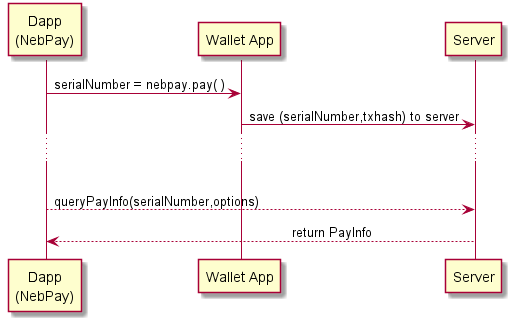

## NebPay SDK

### 简介

NebPay SDK 为不同平台的交易提供了统一的支付接口，开发者在Dapp页面中使用NebPay API可以通过浏览器插件钱包、手机app钱包等实现交易支付和合约调用。

### 接口介绍

目前NebPay 提供了以下接口：
 
接口 | 简介 
:--- | :---
[pay](#pay)| 用于账户间的NAS转账
[nrc20pay](#nrc20pay)|用于NRC20代币的转账，仅接口实现，app不支持
[deploy](#deploy)|用于部署智能合约，仅接口实现
[call](#call)|用于调用智能合约
[queryPayInfo](#querypayinfo)|用于查询支付结果

以上接口中，前四个api对应于[SendTransaction](https://github.com/nebulasio/wiki/blob/master/rpc_admin.md#sendtransaction)接口，细化了`SendTransaction`的使用场景。simulateCall 对应于RPC [Call](https://github.com/nebulasio/wiki/blob/master/rpc.md#call)接口，只用于和浏览器扩展的交互，移动端钱包app不支持该接口。


### 使用说明
在开发Dapp时，如果要使用NebPay SDK来处理交易， 需要将`nebPay.js`插入到Dapp页面中， 然后就可以使用NebPay模块来发送交易了。

当用户在桌面浏览器（chrome）使用Dapp，NebPay会调用浏览器插件来处理交易。当在手机端使用Dapp，NebPay会跳转到钱包app来处理交易.

Dapp中使用NebPay的例子， 可参考`examples/example.html`.

```html
<script src="../dist/nebPay.js"></script>
<script>
    var NebPay = require("nebpay");
    var nebPay = new NebPay();    
    var serialNumber;     //交易序列号
    var options = {
        goods: {        //商品描述
            name: "example"
        },
        callback: NebPay.config.testnetUrl,   //交易查询服务器地址
        listener: undefined //为浏览器插件指定listener,处理交易返回结果
    };
    
    serialNumber = nebPay.pay(to, value, options); //调用交易接口会返回32字节的交易序列号，Dapp端用该序列号查询交易结果
    //一般用setInterval来定时查询直到查询到结果, 查询周期建议10-15s (因为查询服务器限制最多6次/分钟, nebulas出块周期为15s.)
    queryPayInfo(serialNumber, options) //options 指定交易查询服务器地址.
    
</script>
```

#### 接口&参数说明

##### options

每个接口都有一个共同的参数`options`，该参数的详细介绍如下:

```js
var options = {
	goods: {        //Dapp端对当前交易商品的描述信息，app暂时不展示
		name: "",       //商品名称
		desc: "",       //描述信息
		orderId: "",    //订单ID
		ext: ""         //扩展字段
	},
	qrcode: {
		showQRCode: false,      //是否显示二维码信息
		container: undefined,    //指定显示二维码的canvas容器，不指定则生成一个默认canvas
		completeTip: undefined, // 完成支付提示
		cancelTip: undefined // 取消支付提示
	},
	extension: {
		openExtension: true //是否支持插件调用
	},
	mobile: {
		showInstallTip: true, //是否支持手机钱包安装提示
		installTip: undefined // 手机钱包安装提示
	},
	
	// callback 是记录交易返回信息的交易查询服务器地址，
	// 目前我们提供了主网和测试网交易查询服务器, 查询频率不能超过20次/分钟
	//callback: NebPay.config.mainnetUrl,     //主网(默认为主网,可不写)
	callback: NebPay.config.testnetUrl, //测试网
	
	// listener: 指定一个listener函数来处理交易返回信息（仅用于浏览器插件，App钱包不支持listener）
	listener: undefined,
	// if use nrc20pay ,should input nrc20 params like name, address, symbol, decimals
	nrc20: undefined,
	
	// 是否为测试模式，在测试模式下，将打开测试版Nano钱包和切换请求连接
	debug: false
};
```
***

##### pay
发起普通交易支付，指定转账地址和金额。

```
pay(to, value, options)
```

###### 参数说明：

- `to` 转账目的地址

- `value` 转账数额，单位为nas。（wei是Nas的最小单位，1 Nas = 1e18 wei）

- `options` 参见[options](#options)

###### 返回值

- `serialNumber` 交易流水号，用于查询交易信息 

***

##### nrc20pay

发起星云代币交易支付，指定交易代币名称，转账地址和金额。

```
 nrc20pay(currency, to, value, options)
```

###### 参数说明：

- `currency` NRC20代币符号, 即代币简称, 等同于options.nrc20.symbol

- `to` 转账目的地址，该地址为nebulas钱包地址

- `value` 转账数额，单位为 NRC20 token

- `options` 必须指定代币的小数点位数和代币合约地址，另外可指定代币名称、符号。

```js
options = {
    //nrc20参数介绍
    nrc20: {  
        address: "", //NRC20 代币的合约地址
        decimals: 0,    //代币小数点位数, 决定了代币的最小单位
        name: "",    //代币全称, 比如 "Nebulas Token"
        symbol: ""  //代币简称, 比如 "NAS", "EOS"
    }
}
```
###### 返回值

- `serialNumber` 交易流水号，用于查询交易信息 

***

##### deploy

发起部署合约交易，指定合约代码，合约代码类型和参数。**【当前版本暂不支持】**

```
 deploy(source, sourceType, args, options)
```

###### 参数说明：

- `source` 合约源代码

- `sourceType` 合约代码类型

- `args` 合约的初始化函数参数，初始化函数无参数则留空，参数格式为参数数组的JSON字符串，比如`["arg"]` ， `["arg1","arg2"]`。

- `options` 参见[options](#options)

###### 返回值

- `serialNumber` 交易流水号，用于查询交易信息 

***

##### call

发起合约调用交易，指定合约地址，金额，方法名和参数。

```
call(to, value, func, args, options)
```

###### 参数说明：

- `to` 合约地址

- `value` 转账数额，单位为nas。注意value是向合约地址转账，如果合约没有相关的转出函数，则转入的Nas将无法转出。

- `func` 要调用的合约函数名

- `args` 调用的函数参数，格式为参数数组的JSON字符串，比如`["arg"]` ， `["arg1","arg2"]`。

- `options` 参见[options](#options)

###### 返回值

- `serialNumber` 交易流水号，用于查询交易信息 

***

##### queryPayInfo
查询交易信息。

```
queryPayInfo(serialNumber,options)
```

###### 参数说明：

- `serialNumber` 交易序列号，使用上面介绍的接口发送交易后会返回该交易的序列号，是一个32字节随机数。钱包App会将交易结果会上传到交易查询服务器，Dapp端用 `queryPayInfo(serialNumber)` 来查询交易结果信息。
- `options` 对于`queryPayInfo`接口, options 主要用来指定交易查询服务器.

###### 返回值:
 `queryPayInfo`会返回一个`Promise`对象.
 
```js
nebPay.queryPayInfo(serialNumber)
  .then(function (resp) {
      console.log(resp);
  })
  .catch(function (err) {
      console.log(err);
  });
```
 **注意:** 我们提供的查询服务器有查询频率限制, 不得超过6次/分钟, 所以查询周期在10-15s为宜.

#### 交易返回信息的处理
浏览器插件和钱包app对交易返回信息有不同的处理方式。
* 跳转钱包APP发送交易时，钱包App无法直接返回消息给Dapp页面，所以App会将交易信息发送到一个交易查询服务器。
Dapp端需要记录发送交易时返回的序列号`serialNumber`，然后使用`queryPayInfo`接口去查询该交易的序列号以获取交易信息.
* 使用浏览器插件发送交易时，浏览器插件可以直接返回交易结果给Dapp页面，Dapp端可以指定一个`listener`函数来接收并处理交易返回信息。浏览器插件也可以实现将交易结果发送到交易查询服务器。

***注意:*** NebPay并不关心使用的是什么网络(主网/测试网/本地网络), 只是把交易信息发给插件或手机App, 由后者决定使用哪个网络。
NebPay 指定的 callback 是交易查询服务器地址, callback只是告诉钱包App将发送交易后的(serialNumber,txHash)注册到哪个服务器以供查询, 并不能决定交易发送到主网还是测试网。

#### 交易返回信息

`queryPayInfo` 查询到的交易返回信息为JSON字符串, 反序列化得到的js 对象。其格式为：

```json
//查询失败
{
    "code": 1,  
    "data": {},
    "msg": "payId ZBTSkk74dB4tPJI9J8FDFMu270h7yaut get transaction error"
},
//查询成功
{
    "code": 0,
    "data": {
        "data": null,
        "contractAddress": "",
        "type": "binary",
        "nonce": 136,
        "gasLimit": "30000",
        "gasUsed": "20000",
        "chainId": 1001,
        "from": "n1JmhE82GNjdZPNZr6dgUuSfzy2WRwmD9zy",
        "to": "n1JmhE82GNjdZPNZr6dgUuSfzy2WRwmD9zy",
        "value": "1000000000000000000",
        "hash": "f9549a5c01f50f372607b9fd29bf15d483246578f6cc7008d6e2a537920802e6",
        "gasPrice": "1000000",
        "status": 1,
        "timestamp": 1525508076
    },
    "msg": "success"
}
```

 对于浏览器插件，如果指定了`listener`函数，发送交易后将返回`txhash`给`listener`处理，返回的`txhash`信息是一个JSON对象，其格式为：
 
```json
{
    "txhash": "a333288574df47b411ca43ed656e16c99c0af98fa3ab14647ce1ad66b45d43f1",
    "contract_address": ""
}
```

###使用NebPay的交易处理流程如下:



### NebPay 的使用效果示例
这里有个使用nebPay的例子可以参考: [SuperDictionary](https://yupnano.github.io/SuperDictionary/) ，[GitHub链接](https://github.com/15010159959/super-dictionary)

SuperDictionary 的使用过程可参见以下视频：

Youtube:
- [Nebulas Dapp Using NebPay SDK on PC](https://youtu.be/FSFZqoUIT8A)
- [Nebulas Dapp Using NebPay SDK on mobile](https://youtu.be/Cjlo9KKwlNE)

国内视频:
- [[星云链]如何在Dapp中使用NebPay SDK ](https://www.bilibili.com/video/av23217213/)

### 提示
在开发Dapp页面时，如果不想使用NebPay，或者需要处理交易之外的其他消息，则可以使用[neb.js](https://github.com/nebulasio/neb.js)直接访问星云链。
